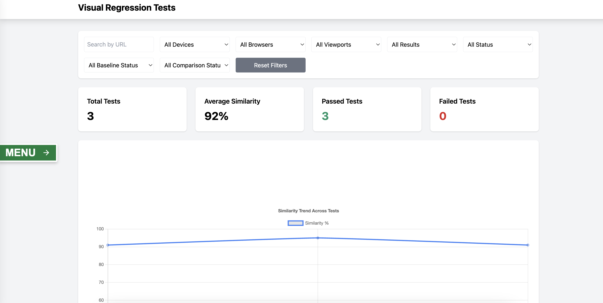
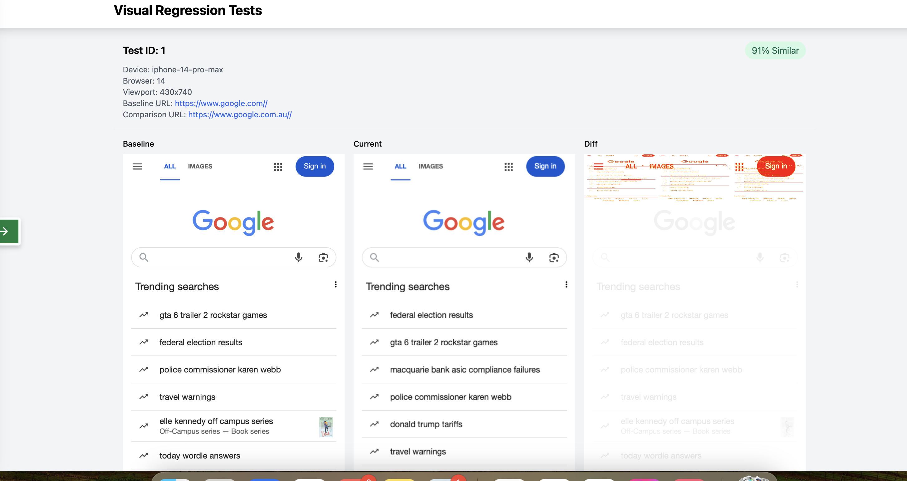

**Playwright Visual Regression Testing**

This guide provides comprehensive instructions for setting up, configuring, and running visual regression tests using Playwright.

**Start testing straightway by updating:**

  - Baseline and Comparison URLS in configuration file.
  
  - Adding url paths for baseline and comparison testing.

**Table of Contents**

Setup

Configuration

Environment Variables

Running Tests

Viewing Reports

GitHub Actions Workflow

**Setup**

**Clone the repository:**

git clone git@github.com:althafhpa/playwright.git

**Install dependencies:**

npm install

**Install Playwright browsers:**

npx playwright install --with-deps

**Update Configuration**

The main configuration is in config.js at the root of the project. 

This file contains settings for:

Test URLs (baseline and comparison)

Page element settings (EMBED or FULL mode)

Comparison thresholds

Authentication methods

Reporting settings

Server settings

module.exports = {
  // URLs for testing environments
  urls: {
    baseline: 'https://www.google.com',
    comparison: 'https://www.google.com.au'
  },

  // Page element settings with support for both EMBED and FULL modes
  pageElements: {
    mode: 'FULL',  // Default mode - will be overridden by TEST_MODE env variable
    
    // Selectors for EMBED mode
    embed: {
      baseline: {
        dataBlock: '[data-block="content-main"]',
        hideElements: '.sidebar-grid h1,.sidebar-grid__sidebar'
      },
      comparison: {
        dataBlock: '[data-block="content-main"]',
        hideElements: 'a[data-back="1"]'
      }
    },
    
    // Selectors for FULL mode
    full: {
      elementsToHide: '',
      baseline: { elementsToHide: '' },
      comparison: { elementsToHide: '' }
    }
  },
  
  // Comparison thresholds
  thresholds: {
    pixel: 10,       // Threshold for pixel difference (0-255)
    hash: 10,        // Threshold for hash difference (0-64)
    failure: 0.1,    // Threshold for test failure rate (0-1)
    similarity: {
      high: 90,      // Threshold for high similarity percentage (0-100)
      medium: 80     // Threshold for medium similarity percentage (0-100)
    }
  },
  
  // Image diff method used for comparison
  image_diff_method: {
    method: 'HASH'   // Options: 'HASH' or 'PIXEL'
  },
  
  // Authentication methods
  authentication: {
    baseline: 'NONE', // Options: 'NONE', 'BASIC', 'OKTA'
    comparison: 'NONE' // Options: 'NONE', 'BASIC', 'OKTA'
  },
  
  // Reporting settings
  reporting: {
    rootDir: 'public'  // Directory where reports will be generated
  },
  
  // Server settings
  server: {
    port: 9222  // Port for the server
  }
};

**Environment Variables**

Some Environment variables can be used to override js configuration settings.

All credentials are used as environment variables.

Create a .env.local file in the project root with the following variables:

**Authentication Credentials**

**Basic Authentication**

HTTP_USERNAME=your_username

HTTP_PASSWORD=your_password

**Okta Authentication**

OKTA_CLIENT_ID=your_client_id

OKTA_USERNAME=your_username

OKTA_PASSWORD=your_password

OKTA_ANSWER=your_security_answer

OKTA_DOMAIN=your_okta_domain

OKTA_REDIRECT_URI=your_redirect_uri

**Test Configuration**

Test mode: EMBED or FULL

Example: TEST_MODE=EMBED

**URLS File**

For Local Testing:

URLS_FILE=urls-local.json

For GitHub Actions:

URLS file is generated using script custom/scripts/generate-matrix-config.js in the workflow.

**Envirnonment Variables:**

File .env.local and for GitHub Actions use GitHub Secrets.

HTTP_PASSWORD=your_password

OKTA_CLIENT_ID=0oa3jai5dbtihd72t3l7

OKTA_USERNAME=user@example.com

OKTA_PASSWORD=password123

OKTA_ANSWER=answer1

OKTA_DOMAIN=login-preprod.example.com

OKTA_REDIRECT_URI=https://example.com/callback

URLS_FILE=urls-local.json

TEST_MODE=EMBED

**Running Tests**

**1. Prepare Test Data**

Convert your CSV file containing test URLs to JSON:

node ./custom/scripts/csv-to-json.js

By default, this will convert ./fixtures/urls.csv to JSON. You can specify a different CSV file:

node ./custom/scripts/csv-to-json.js ./fixtures/my-urls.csv

**2. Run Baseline Tests**

Capture baseline screenshots:

./baseline.sh

**3. Run Comparison Tests**

Capture comparison screenshots and compare with baseline:

./comparison.sh

**4. Generate Reports**

Generate visual regression reports and start server to view reports:

./report.sh

**GitHub Actions Workflow**

The repository includes a GitHub Actions workflow for running visual regression tests in CI/CD. 

The workflow is defined in .github/workflows/visual-regression.yml.

**The workflow file .github/workflows/visual-regression.yml:**

Prepares test data by converting CSV to JSON

Splits tests into chunks for parallel execution

Runs baseline and comparison tests across multiple browsers and devices

Generates a comprehensive report

Uploads the report as an artifact

To run the workflow manually, go to the Actions tab in your GitHub repository and select "Visual Regression" workflow, then click "Run workflow".

Environment Variables in GitHub Actions

The workflow uses the following environment variables, which can be set as GitHub Secrets:

env:
  
  HTTP_USERNAME: ${{ secrets.HTTP_USERNAME || 'default_username' }}
  
  HTTP_PASSWORD: ${{ secrets.HTTP_PASSWORD || 'default_password' }}
  
  OKTA_CLIENT_ID: ${{ secrets.OKTA_CLIENT_ID || 'default_client_id' }}
 
  OKTA_USERNAME: ${{ secrets.OKTA_USERNAME || 'default_username' }}
  
  OKTA_PASSWORD: ${{ secrets.OKTA_PASSWORD || 'default_password' }}
  
  OKTA_ANSWER: ${{ secrets.OKTA_ANSWER || 'default_answer' }}
  
  OKTA_DOMAIN: ${{ secrets.OKTA_DOMAIN || 'default_domain' }}
  
  OKTA_REDIRECT_URI: ${{ secrets.OKTA_REDIRECT_URI || 'default_uri' }}

**For issues:**

Look for errors in the console output

**More documentation:**

**Workflow:**

[.github/workflows/visual-regression.md](.github/workflows/visual-regression.md)

**Environment Variables:**

[env.md](env.md)

[env.local.txt](env.local.txt)

**Sample URLS File:**

[fixtures/urls.json.txt](fixtures/urls.json.txt)

